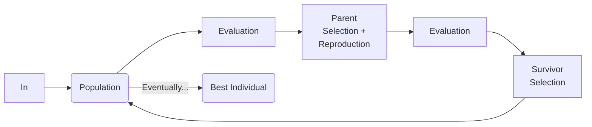

*General designation for a stochastic optimization technique inspired by the principles of [[Nature-inspired AI|natural selection and biological evolution]] (mimicking processes like reproduction, mutation, recombination, and survival of the fittest to improve solutions iteratively).*
## Characteristics
- **Population-Based**: EAs maintain a pool (population) of candidate solutions
- **Fitness-Driven**: Solutions are evaluated based on a fitness function 
- **Stochastic**: Incorporates randomness in variation (mutation, crossover) and selection
- **Iterative**: Solutions evolve over multiple generations toward an optimal or satisfactory result
In nature, species evolve to adapt to their environment. This evolution is driven by: 
- **Mutation**: Random changes in DNA create diversity
- **Recombination**: Controls how offspring inherit traits from parents 
- **Selection**: Fitter individuals are more likely to reproduce
#### Reasons to Use
- Many real-world optimization problems are **Complex** (non-convex, nonlinear, or multimodal with many local optima) and/or **Black-Box** (no explicit mathematical model; only input-output relationships)
- **Limitations of Traditional Methods**: Gradient-based methods struggle with non-differentiable / noisy objective functions and high-dimensional, multimodal search spaces. Exhaustive search is computationally expensive for large problems
- **EAs are robust and flexible**: They do not require gradients or explicit mathematical models; can escape local optima using diversity-enhancing mechanisms; adapt to a wide range of problem types (continuous, discrete, or mixed)
## Algorithm
```python 
def evolutionary_algorithm():
    population = initialize_population()
    while not stop_criteria_met():
        fitness_values = evaluate_fitness(population, fitness_function)
        parents = parent_selection(population, fitness_values)
		offspring = reproduction(selected_individuals, crossover, mutation)
        fitness_values = evaluate_fitness(offspring, fitness_function)
        population = survivor_selection(offspring)
    return get_best_individual(population)
```

- **Representation**: How to represent candidate solutions for the problem at hand.
- **Fitness Evaluation**: Each candidate solution is evaluated using a fitness function, which measures its performance or quality
- **[[Genetic Operators|Selection & Variation]]**
#### Features
- **Population-Based Search**: Explores multiple solutions simultaneously, reducing the chance of getting stuck in local optima
- **Stochasticity**: Randomness in variation and selection introduces diversity
- **Robustness**: Handles complex, noisy, or black-box problems effectively
- **Strengths**: Global search capability; Does not require derivatives or smoothness; Flexible across various domains and problem types
- **Weaknesses**: Computationally expensive for large populations or generations; Sensitive to parameter tuning (e.g., population size, mutation rate).