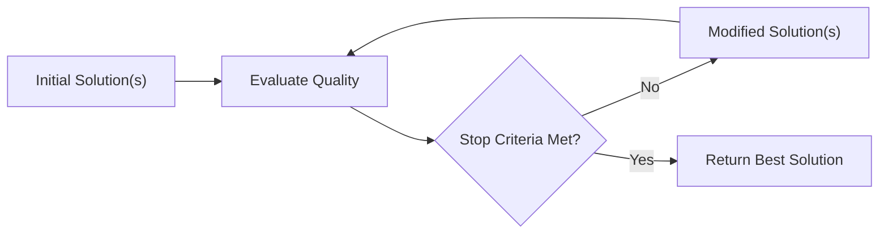

*High-level, general-purpose algorithms designed to find good (often approximate) solutions to complex optimization problems.*
## Characteristics
- Meta-Heuristics **do not guarantee an exact or optimal solution** but aim to find satisfactory solutions within a reasonable time frame
- **General-purpose**: Appliable to a wide range of problems
- **Stochasticity**: Often include stochastic (random) components to explore the search space
- **Exploration vs. Exploitation**: Search strategies aim to explore the solution space broadly while refining the best solutions found
#### General Algorithm

1. **Initial Solution Generation**: e.g., Randomly
2. **Quality Evaluation**: Objective function to measure how good a solution is to the problem 
3. **Stop Criteria**: Stop the search by a fixed number of iterations, reaching a solution threshold, or exhausting time/resources
4. **Solution Modification**: Stop the search by a fixed number of iterations, reaching a solution threshold, or exhausting time/resources
#### Reasons to Use
- **Non-Differentiable Functions**: Some problems have objective functions that are not differentiable, making gradient based methods (like gradient descent) inapplicable
- **Non-Convex Search Spaces**: The search space may contain multiple local optima, and traditional optimization methods often need help
- **High-Dimensional or Combinatorial Complexity**: Problems with large numbers of variables or discrete choices are computationally expensive to solve exactly
- **Constraints and Irregular Search Spaces**: Real-world problems often have constraints (e.g., resource limits, physical restrictions) that make the search space irregular or disconnected
#### Advantages
- **Robustness**: Can handle diverse types of problems, including continuous, discrete, constrained, or mixed problems. Effective even for noisy or black-box objective functions.
- **Global Search Capability**: Use mechanisms to escape local optima, increasing the likelihood of finding near-optimal solutions in complex landscapes.
- **Flexibility**: Can be easily adapted or hybridized with other optimization techniques to improve performance for specific problems.
- **Efficiency**: Often find good solutions within a reasonable time frame, especially for large or complex problems where exact methods are impractical.
## Algorithms
#### Random Search
Randomly samples the search space without any guidance, relying on chance to find good solutions. Its purpose is to establish a baseline for comparison against more advanced optimization methods.
#### Hill Climbing
Iteratively improve a solution by exploring its neighbors and moving in the direction of the greatest improvement.
- **Local Search**: Hill Climbing focuses only on solutions in the immediate neighborhood of the current solution
- **Greedy Improvement**: At each step, the algorithm moves to the neighbor with the best improvement in the objective function. It does not look ahead or consider global information
- **Iterative Process**: The algorithm repeatedly evaluates and moves to better solutions until no neighbor improves the solution (local optimum) or a termination condition (e.g., maximum iterations) is met
- Works for both **discrete and continuous** problems
- **Strengths:** Simple & Deterministic!
- **Weaknesses**: Can get stuck in local optima / plateaus. Focuses entirely on exploitation. Bad for bumpy data landscapes
###### Variants
- **Simple Hill Climbing (First-Ascent Hill Climbing)**: Evaluate neighbors one by one in a random order. Move to the first neighbor that improves the solution. Fast but does not guarantee finding the steepest path.
- **Steepest Ascent Hill Climbing**: Evaluate all neighbors before deciding on the next move. Move to the neighbor with the best improvement in the objective function. More thorough and often leads to better solutions but is slower due to evaluating all neighbors
- **Stochastic Hill Climbing**: Instead of deterministically moving to the best neighbor, choose a neighbor probabilistically based on improvement. Neighbors with higher improvement have a higher probability of being selected. Adds randomness to escape poor local optima
#### Simulated Annealing
Inspired by the annealing process in metallurgy, where controlled cooling allows atoms to settle into a low-energy state. SA uses a probabilistic acceptance criterion to escape local optima and explore the search space more effectively.
- **Probabilistic Acceptance of Solutions**: Unlike greedy algorithms like Hill Climbing, SA accepts worse solutions with a certain probability of escaping local optima. This is controlled by: 
	- **Temperature**: High encourages exploration by accepting worse solutions. Low reduces randomness, focusing on exploitation
- **Global Search Capability**: By probabilistically accepting worse solutions, SA can escape local optima, making it suitable for multimodal and non-convex optimization problems
- **Strengths**: *Escapes local optima* by accepting worse solutions with a certain probability, being effective for multimodal and non-convex optimization problems; *Global Search Capability*; *Controlled Exploration and Exploitation*
- **Weaknesses**: *Computationally Expensive* (caused by the slow cooling schedule required for high-quality solutions, especially for large or high-dimensional problems); *Performance Depends on Parameter Tuning* (Cooling schedule may be linear, exponential, or logarithmic; Initial temperature must be high enough to allow sufficient exploration; Step size for generating new candidate solutions); *Slow Convergence*