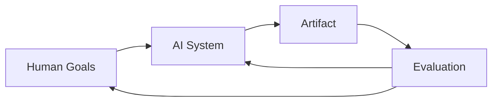

*Process where humans and AI systems collaborate to produce creative outcomes.*
## Definition
- Involves a dynamic interaction between human creativity and AI capabilities, where both parties contribute to the creative process. Co-creativity can be seen as a partnership where AI acts as a tool, collaborator, or even a co-creator, enhancing human creativity by providing new perspectives, generating ideas, or assisting in the execution of creative tasks. 
- It uses the following loop:

## Probabilistic View
We design a loop:
$$ \text{Intent/Constraints}~x→\text{Generator}~q_θ(· |x)→{c_{1},...,c_{K}}→\text{Ranker}~s_ϕ(· |x)→\text{Choice}$$
- **Intent/Constraints:** The desired outcome or limitations that guide the generation process. This could include specific themes, styles, or content requirements.
- **Generator:** The AI model that produces a set of candidate outputs based on the given intent and constraints (variation → stochastic exploration). It generates multiple options ($c_1$,...$c_K$) for consideration
- **Ranker:** The evaluation mechanism that assesses the generated candidates against the intent and constraints. It assigns scores or ranks to each candidate based on how well they align with the desired outcome. Uses ranker function $s(u,i,x)∈R$  ⇒ recommend top-K items by $s(u,i,x)$
- **Choice:** The final selection of the output that best meets the intent and constraints, as determined by the rankers. This is the output that will be used for entertainment purposes
- **Feedback Loop:** The process can be iterative, where the choice made can influence future generations and rankings, allowing for continuous improvement and adaptation to user preferences or changing constraints. Constraints $x$, user state $u$, generator parameters $θ$ and ranker parameters $ϕ$ can be updated based on feedback from the choice, creating a dynamic system that evolves over time