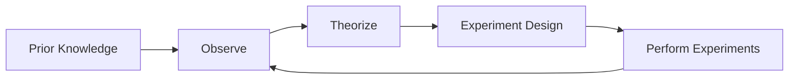

*A set of procedures and protocols used to test hypotheses and validate theories in scientific research.*

**Why do them?** They allow **researchers** to: 
- Collect evidenced facts about the system they are experimenting on
- Validate hypotheses
- Support the definition, validation, parameterization of models
And they allow **engineers** to:
- Tune up systems
- Compare and select among different project choices
- Verify if specifications / requirements are met
- Validate solutions / mechanisms
- Measure / evaluate features
- Assess process effectiveness (e.g. SDLC)
## Properties
- **Relevance:** Importance of the experiment for the desired goals (e.g., scientific progress)
- **Representativeness:** How well the experiment reflects real-world conditions or the intended application domain.
- **Repeatability:** Ability to perform the experiment again under the same conditions and obtain similar results.
- **Reproducibility:** If there is enough information for other researchers to replicate the experiment and obtain similar results.
- **Result Analysis:** Are the results correctly analyzed? Are the conclusions generalizable?
- **Cost:** Is the cost of the experiments compatible with the expected benefits?
## Scientific Method
1. **Prior Knowledge**: Gather existing information and insights about the topic of interest.
2. **Observe**: Identify phenomena, patterns, or problems that need explanation.
3. **Theorize**: Formulate hypotheses or theories to explain the observed phenomena.
4. **Experiment Design**: Plan and design experiments to test the hypotheses, ensuring they are controlled and reproducible.
5. **Perform Experiments**: Conduct the experiments, collect data, and analyze the results to determine if they support or refute the hypotheses.

## Considerations
#### Relevant Questions
- Was the experiment designed correctly (concerning its goals)?
- Was it based on a toy scenario or in a realistic one (or in a real situations)?
- Were the measurements used appropriate for the goals of the experiment?
- Was the experiment run for long enough time?
- Is it possible to reproduce the experiment (same team) and get similar results?
- Is it possible to replicate the experiment (other team)? 
- Are the conclusions correct? 
- Are the results not biased? 
- Is the generalization of the results credible?
#### Responsible Skepticism
- Constantly look for:
	- Failures in experimental designs
	- Failures of observations
	- Gaps in reasoning
	- Alternative explanations
- Compare new evidence against old 
- Raise counter objections/hypotheses 
- Question grounds for doubt as well 
- Accumulate weight of evidence